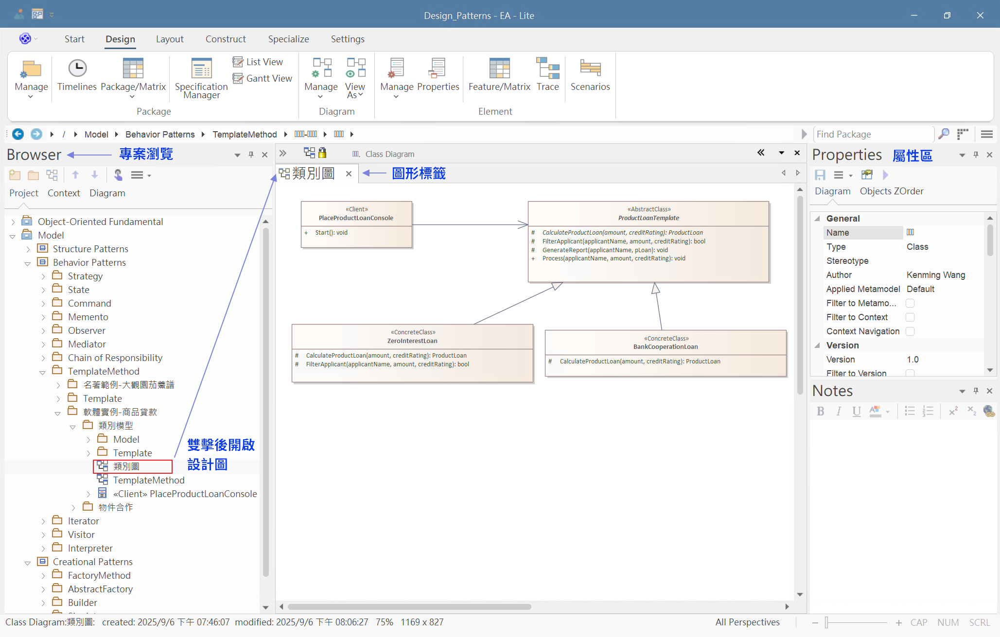

# UML 模型範例檔使用說明

## 概述

本目錄包含《把軟體作軟的設計模式思維》一書中所有 UML 設計圖的原始設計模型，使用 [**Sparx Enterprise Architect**](https://sparxsystems.com/products/ea/) 專業建模工具繪製。

## UML 模型檔案說明
- 包含本書「物件導向基礎」與「設計模式完整設計」所有設計圖，包含 UML 類別圖 (Class Diagram) 以及 循序圖 (Sequence Diagram)。
- 使用 Sparx Enterprise Architect 16.x 設計，相容於 12.x 以上版本（支援 .qea 格式）。
- 採用 XMI 2.1 標準格式，可以使用其它 UML 工具 (支持 XMI 2.1 規格) 匯入 .xml 格式檔案 (專案儲庫已包含所匯出的檔案)。
- 建議使用官方免費的 Enterprise Architect Viewer (可以檢視但無法編輯) 開啟本模型檔案，以便檢視設計圖並參照對應的程式碼範例。

## 工具下載與安裝

### Enterprise Architect Lite
- **下載位址**: [https://sparxsystems.com/bin/ealite_x64.msi](https://sparxsystems.com/bin/ealite_x64.msi)
- **官方文件**: [EA Lite 使用指南](https://sparxsystems.com/enterprise_architect_user_guide/17.1/getting_started/ea_lite.html)
- **系統需求**: Windows 作業系統
- **授權**: 免費版本（功能有限制）

### 安裝步驟
1. 下載 `ealite_x64.msi` 安裝檔
2. 執行安裝程式，依照指示完成安裝
3. 啟動 Enterprise Architect Lite
4. 開啟 `thinking-in-design-patterns.qea` 檔案

## 如何瀏覽模型

### 1. 開啟專案
1. 啟動 Enterprise Architect Lite
2. 選擇 **File > Open Project**
3. 瀏覽並選擇 `thinking-in-design-patterns.qea`
4. 點擊 **Open**

### 2. 導覽面板使用
- **Project Browser**: 左側面板顯示完整的套件結構
- **Diagram View**: 中央區域顯示 UML 圖表
- **Properties**: 右側面板顯示選中元素的屬性

## 🛠️ 基本操作指南

### 檢視圖表
1. 在專案瀏覽器中雙擊圖表名稱
2. 使用滑鼠滾輪縮放圖表
3. 拖曳圖表進行平移

### 檢視元素屬性
1. 在圖表中右擊任何元素
2. 選擇 `Properties` 查看詳細屬性
3. 查看註解、約束等附加資訊

### 圖表導航
- **F9**：顯示圖表總覽視窗
- **Ctrl + 滑鼠滾輪**：快速縮放
- **空格鍵 + 拖曳**：平移圖表

**注意**: 本模型檔案僅供學習使用，請遵守相關授權條款。

[返回主 README →](../README.md)